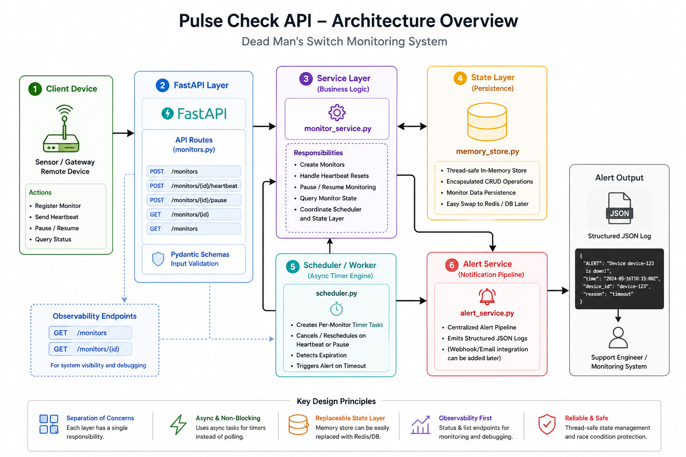

# Pulse Check API (Watchdog Sentinel)

A **Dead Man’s Switch Monitoring System** built with FastAPI that tracks remote devices and automatically triggers alerts when they stop sending heartbeats.

This project is designed as a production-ready monitoring platform with clear architecture, async scheduling, structured logging, and observability.

---

# Problem Statement

Remote devices such as solar farms, sensors, and weather stations must send periodic heartbeats.
If a device stops responding, the system must:
- detect the failure
- trigger an alert automatically
- keep alert delivery reliable and observable

---

# Core Concept

Each device is represented by a monitor with a countdown timer:

- heartbeat received → timer resets
- timer reaches zero → alert is triggered
- paused monitor → no alert fires
- resumed monitor → monitoring continues from the latest state

---

# Architecture

Client Device
↓
FastAPI Layer (Routes)
↓
Service Layer (Business Logic)
↓
State Layer (In-memory Store)
↓
Scheduler / Worker (Timer Engine)
↓
Alert Service (Notification System)

📊 Architecture Diagram:


---

# Features

## Core Features
- Register device monitors
- Reset monitor timer with heartbeat
- Detect device timeout and trigger alerts
- Pause and resume monitors
- Observe monitor status and list all monitors

## Production Improvements
- Async scheduler with per-monitor expiration tasks
- Thread-safe in-memory state manager
- Centralized alert service with structured JSON logging
- Backward-compatible API routes

---

# API Documentation

## 1. Register Monitor

### `POST /monitors`

Request body:

```json
{
  "id": "device-123",
  "timeout": 60,
  "alert_email": "admin@critmon.com"
}
```

Success response:

- `201 Created`

```json
{
  "message": "Monitor created",
  "id": "device-123"
}
```

Error responses:

- `409 Conflict`

```json
{
  "detail": "Monitor already exists"
}
```

- `422 Unprocessable Entity`

```json
{
  "detail": [
    {
      "loc": ["body", "timeout"],
      "msg": "field required",
      "type": "value_error.missing"
    }
  ]
}
```

## 2. Heartbeat

### `POST /monitors/{id}/heartbeat`

Success response:

- `200 OK`

```json
{
  "message": "Heartbeat received"
}
```

Error responses:

- `404 Not Found`

```json
{
  "detail": "Monitor not found"
}
```

- `422 Unprocessable Entity`

```json
{
  "detail": [
    {
      "loc": ["body", "id"],
      "msg": "field required",
      "type": "value_error.missing"
    }
  ]
}
```

## 3. Pause Monitor

### `POST /monitors/{id}/pause`

Success response:

- `200 OK`

```json
{
  "message": "Monitor paused"
}
```

Error responses:

- `404 Not Found`

```json
{
  "detail": "Monitor not found"
}
```

- `422 Unprocessable Entity`

```json
{
  "detail": [
    {
      "loc": ["body", "id"],
      "msg": "field required",
      "type": "value_error.missing"
    }
  ]
}
```

## 4. Get Monitor Status

### `GET /monitors/{id}`

Success response:

- `200 OK`

```json
{
  "id": "device-123",
  "timeout": 60,
  "alert_email": "admin@critmon.com",
  "expires_at": 1700000000.0,
  "status": "active",
  "paused": false
}
```

Error response:

- `404 Not Found`

```json
{
  "detail": "Monitor not found"
}
```

## 5. List Monitors

### `GET /monitors`

Success response:

- `200 OK`

```json
[
  {
    "id": "device-123",
    "timeout": 60,
    "alert_email": "admin@critmon.com",
    "expires_at": 1700000000.0,
    "status": "active",
    "paused": false
  }
]
```

## 6. Alert Output

When a device fails, alerts are logged in structured JSON:

```json
{
  "ALERT": "Device device-123 is down!",
  "time": "2026-04-25T12:00:00Z",
  "device_id": "device-123",
  "reason": "timeout"
}
```

---

# Setup Instructions

1. Clone repository

```bash
git clone https://github.com/EngineerFabrice/pulse-check-api.git
cd pulse-check-api
```

2. Create virtual environment

```bash
python -m venv .venv
.venv\Scripts\activate
```

3. Install dependencies

```bash
pip install -r requirements.txt
```

4. Run server

```bash
uvicorn app.main:app --reload
```

5. Open API docs

http://127.0.0.1:8000/docs

---

# Design Decisions

## In-Memory State Store

The state layer is encapsulated in `app/state/memory_store.py` with a lock-protected monitor store. It can be replaced with Redis without changing service behavior.

## Async Scheduler

The timer engine in `app/services/scheduler.py` uses asynchronous expiration tasks instead of polling loops. Each monitor gets its own timer task, which can be canceled or rescheduled safely.

## Separation of Concerns

- API layer → request validation and route handling
- Service layer → business logic and scheduler coordination
- State layer → persistence and monitor state management
- Alert service → centralized notification pipeline

## Structured Logging

Logger is configured in `app/core/logger.py` for JSON output, enabling production-ready observability and downstream log ingestion.

## Developer's Choice

I added the monitor status and list endpoints (`GET /monitors/{id}` and `GET /monitors`) so support engineers can inspect current device state without relying only on alert logs. This improves operability for on-demand incident triage and makes the system more robust for real-world monitoring workflows.

---

# Testing

Run the test suite:

```bash
python -m pytest -q
```

---

# Project Structure

```text
app/
├── api/
├── core/
├── models/
├── schemas/
├── services/
├── state/
└── workers/

tests/
```

---

# Tech Stack

- Python 3.10+
- FastAPI
- Uvicorn
- AsyncIO

---

# Author

Fabrice Ndayisaba
Computer & Software Engineering Student
Stop heartbeat → timer expires
Alert is triggered
Retry alert fires if device stays down
📁 Project Structure

app/
├── api/
├── core/
├── models/
├── schemas/
├── services/
├── state/
├── utils/
├── workers/

tests/

🚀 Tech Stack
Python 3.10+
FastAPI
Uvicorn
AsyncIO
📌 Author

Fabrice Ndayisaba
Computer & Software Engineering Student